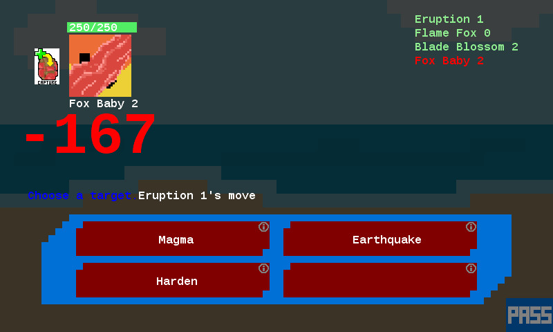
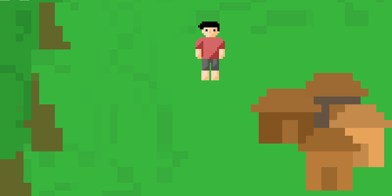

# PixelRPG

A small, handcrafted game featuring monster evolutions and battles.

## Features

- monster battles across a hand-drawn, pixel-art land
- evolution of monsters to unlock powerful moves

## Available on Steam

Check it out and download the game at [Steam](https://store.steampowered.com/app/933290/PixelRPG/).

## Building

It has been years since I even ran this game, but I think that it requires Visual Studio 2017 to build. It also requires [MonoGame](https://www.monogame.net/). 
